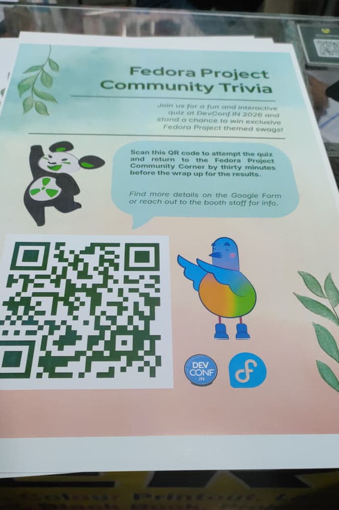
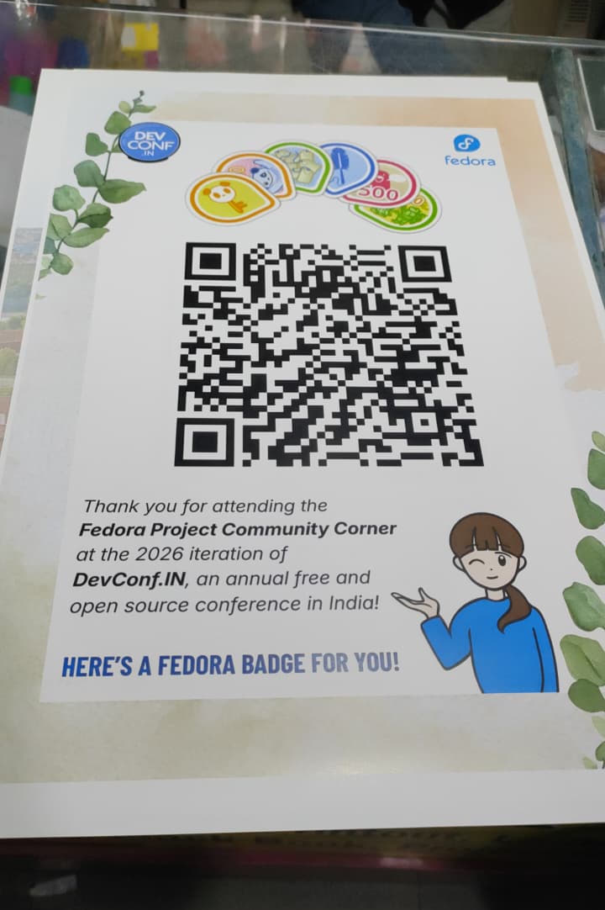
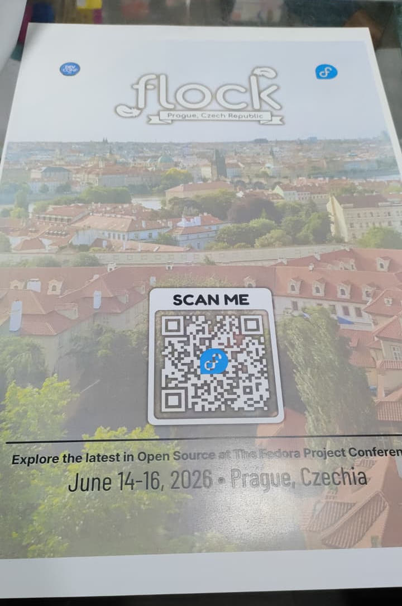
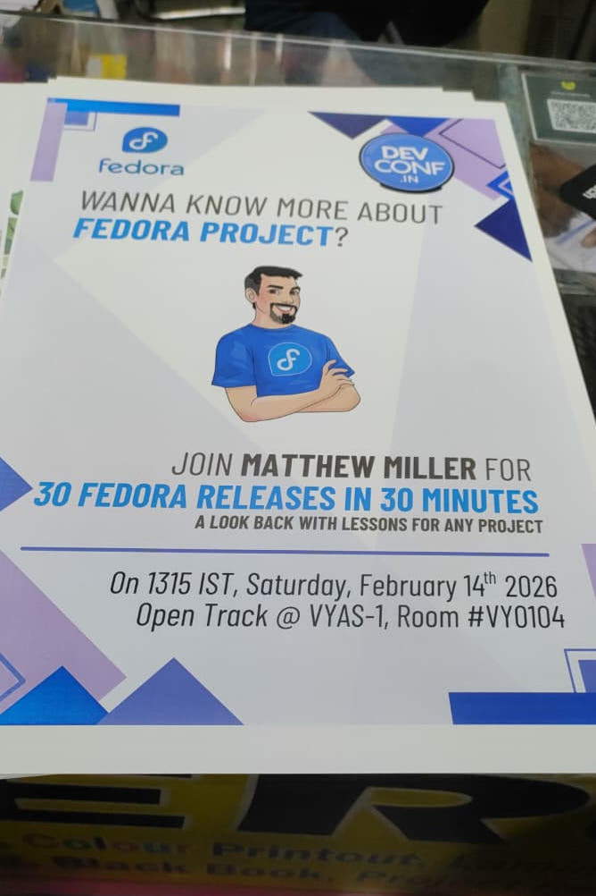

##### [← Back to DevConf.IN 2026 Overview](../)

## The Preparation Begins

A couple of days before [DevConf.IN 2026](https://www.devconf.info/in/), the real work began. As someone who would be representing the [Fedora Project](https://fedoraproject.org/) at a booth for the first time, I knew preparation was key.

### Getting the Fliers Printed

[Akash](https://fedoraproject.org/wiki/User:T0xic0der) asked me to get the prints of fliers he created to be showcased in the booth. Finding a shop which would have the required print quality along with the willingness to provide a receipt for it was an adventure in its own terms.

After going around for a while from shop to shop, I finally found one who had what we needed. After verifying the quality of the paper, colour accuracy and the type of the receipt with [Akash](https://fedoraproject.org/wiki/User:T0xic0der), I finally got the prints done.

<table>
<tr>
<td width="50%" align="center">

Fedora Project Trivia (Shounak Dey, CC BY-SA 4.0)
</td>
<td width="50%" align="center">

Fedora Project Badge (Shounak Dey, CC BY-SA 4.0)
</td>
</tr>
<tr>
<td width="50%" align="center">

Flock to Fedora 2026 (Shounak Dey, CC BY-SA 4.0)
</td>
<td width="50%" align="center">

Matthew Miller's Talk (Shounak Dey, CC BY-SA 4.0)
</td>
</tr>
</table>

These fliers served multiple purposes at the booth, from promoting the trivia game where attendees could win special swag, to explaining how to claim digital Fedora badges after creating FAS accounts, announcing the upcoming Flock to Fedora 2026 conference and highlighting Matthew Miller's highly anticipated talk. Each flier was carefully designed by [Akash](https://fedoraproject.org/wiki/User:T0xic0der) to be eye catching and informative, helping us engage with attendees and guide them through different aspects of the [Fedora Project](https://fedoraproject.org/) community.

---

## Getting Ready to Answer Questions

As someone who had primarily worked behind the screen on different [Fedora Applications](https://apps.fedoraproject.org/), the thought of being the face of [Fedora Project](https://fedoraproject.org/) at a booth was both exciting and nerve-wracking. I knew I'd be fielding questions from attendees with varying levels of Linux experience (from complete beginners to seasoned developers).

So I spent time preparing for the kinds of questions that might come up:

### Technical Questions

- **What is Fedora and how does it differ from other distributions?**
  I prepared to explain Fedora's philosophy, its relationship with Red Hat and how it differs from Ubuntu, Debian, Arch and other distros.

- **What are Fedora's core principles?**
  Freedom, Friends, Features, First! I made sure I could explain each principle clearly.

- **How does Fedora's release cycle work?**
  Understanding the 6-month release cycle and what it means for users.

- **What desktop environments does Fedora support?**
  GNOME as default, plus KDE, Xfce, LXQt and other spins.

- **Why should someone choose Fedora?**
  Being able to articulate the benefits: cutting-edge software, strong community, upstream-first approach, excellent for developers.

### Contribution-Related Questions

- **How can I start contributing to Fedora?**
  I wanted to have clear pathways ready for different interests and skill levels.

- **Do I need to be a programmer to contribute?**
  Absolutely not! I prepared to talk about Design, Documentation, Translation, QA, Marketing and Community roles.

- **What are the different contribution areas?**
  Infrastructure, Package Maintenance, Documentation, Design, QA, Community Outreach, etc.

- **How does the Fedora Account System (FAS) work?**
  Being ready to help people create accounts and claim their first badges.

- **What resources are available for new contributors?**
  [Fedora Join](https://fedoraproject.org/wiki/Join), [Fedora Docs](https://docs.fedoraproject.org/), [Discussion Forum](https://discussion.fedoraproject.org/) and Matrix channels.

### Community Questions

- **How is Fedora governed?**
  Understanding the [Fedora Council](https://docs.fedoraproject.org/en-US/council/), working groups and community structure.

- **What's the relationship between Fedora and Red Hat?**
  Being able to explain the upstream relationship and Red Hat's sponsorship.

- **How can I join the Fedora community?**
  Pointing to local communities, SIGs (Special Interest Groups) and getting involved.

- **Are there local Fedora communities in India?**
  Knowing about Fedora India community efforts and regional groups.

---

## Preparing Project Knowledge

I also brushed up on:

- **Recent Fedora developments** and features in the current release
- **Fedora Workstation vs. Server vs. IoT vs. CoreOS** - different editions for different use cases
- **Projects I could point interested contributors to**, especially the [Fedora Badges Revamp Project](https://discussion.fedoraproject.org/t/a-history-lesson-2025-2026-update-on-fedora-badges-revamp-project/175412) that I've been actively working on
- **How to navigate the Fedora ecosystem** - from asking questions on Matrix to opening tickets on Pagure/GitLab

---

## The Mindset Shift

More than just memorizing facts, I realized that booth staffing was about:

- **Listening first** - Understanding what the attendee actually wants to know
- **Guiding, not lecturing** - Helping them find their path rather than overwhelming them with information
- **Being approachable** - Creating a welcoming environment where people feel comfortable asking "silly" questions
- **Making connections** - Remembering that behind every question is a person who might become a contributor, a user, or a community member
- **Admitting when I don't know** - And being ready to find the answer together or point them to someone who does

**The key realization:** This wasn't just about representing a Linux distribution. It was about representing a **community**, a global network of people who believe in open source, collaboration and making technology accessible to everyone.

---

## Ready (Sort Of)

Did all this preparation make me feel 100% ready? Not really. But it gave me a foundation to build on. The real learning, I knew, would happen when I was actually at the booth, face-to-face with attendees, thinking on my feet.

As it turned out, the questions I prepared for were exactly the kinds of questions I'd get asked and then some I hadn't anticipated at all. But having that foundation made all the difference.

---

##### [Day 1: Setting Up & Finding My Voice →](../day-1/)