##### [← Back to Day 0: Preparation & Getting Ready](../day-0/)

## Day 1 Highlights (TLDR):
- Booth setup complete by 10:30 AM
- Met [Matthew Miller](https://mattdm.org/) ([Ex-FPL](https://docs.fedoraproject.org/en-US/council/fpl/))
- Answered countless questions about Fedora from budding Linux enthusiasts
- Distributed swag and ran Fedora trivia with ~90 registrations
- Squeezed in a quick 15-minute lunch (after climbing 8 floors!)
- Explored [OKD](https://www.okd.io/) and [Backstage](https://backstage.io/) booths
- Special swag giveaway to 4 lucky winners!
- Community dinner at Wasabi 15 with deep conversations about open source and AI contributions

---

## The Morning Rush

The day started with a couple of unexpected situations. First, [Akash](https://fedoraproject.org/wiki/User:T0xic0der) mentioned that he wouldn’t be able to drop by my place to do an inventory check of the swag packs that were delivered there. This meant I also had to make an unusual purchase of double-sided tape to ensure we could paste fliers at the [Fedora Project](https://fedoraproject.org/) booth. Not the most glamorous start, but hey, conference prep is all about the details!



After waiting for a while, [Akash](https://fedoraproject.org/wiki/User:T0xic0der) finally arrived and we were on our way to the venue [MIT World Peace University (MIT WPU)](https://maps.app.goo.gl/F1Ju9MJaSqCNMpsV8), arriving around **10:00 AM**. But to our surprise, the venue had been moved to the newly constructed Vyas Building, which meant we had to walk over a kilometer carrying the swag packs. To our relief, [Avadhoot Dhere](https://www.linkedin.com/in/avadhoot-dhere-a035801a2/) was there at the building’s entrance and helped us carry our load to the [Fedora Project](https://fedoraproject.org/) booth.



## Booth Setup

Once we entered Vyas Building, we saw the registration desk filled with attendees doing registrations. We ignored the registration part as we thought we were already late (which was not the case at all).

During that time [Samyak](https://fedoraproject.org/wiki/User:Jnsamyak) and [Yashwanth](https://fedoraproject.org/wiki/User:Thisisyaash) were already there attending the Opening Keynote at 8th Floor. [Akash](https://fedoraproject.org/wiki/User:T0xic0der) asked [Samyak](https://fedoraproject.org/wiki/User:Jnsamyak) and [Yashwanth](https://fedoraproject.org/wiki/User:Thisisyaash) to come down to the [Fedora Project](https://fedoraproject.org/) booth so we could start setting it up.

After a brief introduction with [Samyak](https://fedoraproject.org/wiki/User:Jnsamyak) and [Yashwanth](https://fedoraproject.org/wiki/User:Thisisyaash), we started unpacking the swag box and the fliers. [Akash](https://fedoraproject.org/wiki/User:T0xic0der) and [Yashwanth](https://fedoraproject.org/wiki/User:Thisisyaash) started setting up the badges and stickers while [Samyak](https://fedoraproject.org/wiki/User:Jnsamyak) and I started setting up the fliers.

By **10:30 AM**, our booth was up and running.

<table>
<tr>
<td width="50%" align="center">
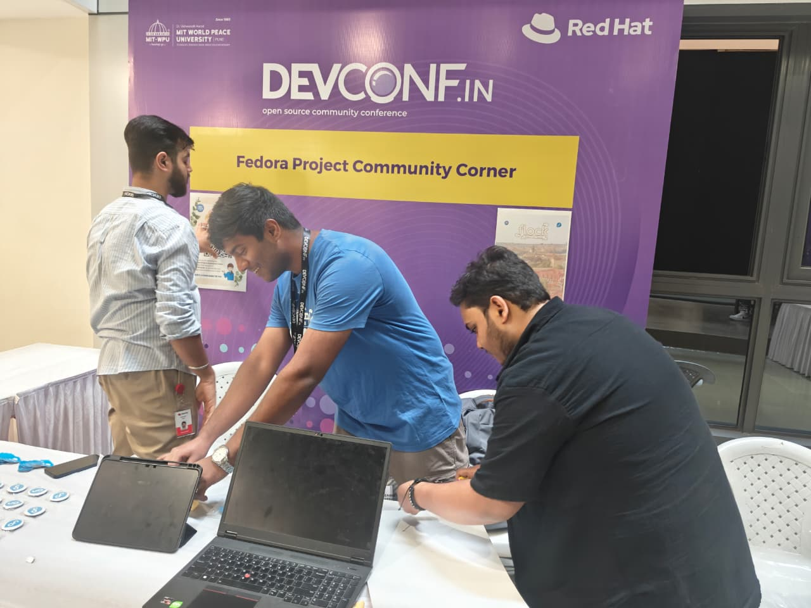
Booth Setup - Image 1 (Akashdeep Dhar, CC BY-SA 4.0)
</td>
<td width="50%" align="center">
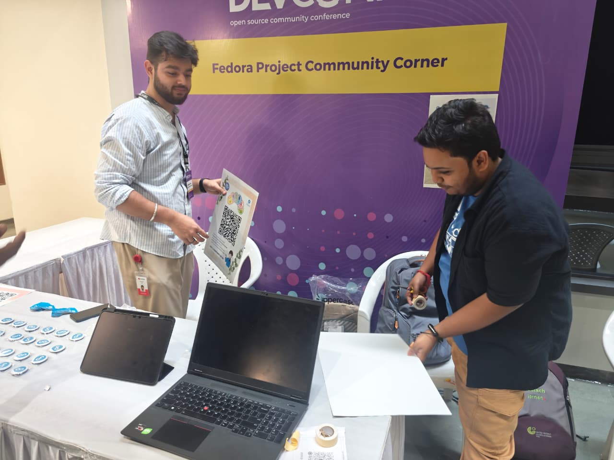
Booth Setup - Image 2 (Akashdeep Dhar, CC BY-SA 4.0)
</td>
</tr>
</table>

Shortly after, [Matthew Miller](https://mattdm.org/) ([Ex-FPL](https://docs.fedoraproject.org/en-US/council/fpl/)) visited our booth. [Akash](https://fedoraproject.org/wiki/User:T0xic0der) jokingly asked him, "Hey Matthew, did you use Fedora Linux?" which was hilarious.

<table>
<tr>
<td width="50%" align="center">
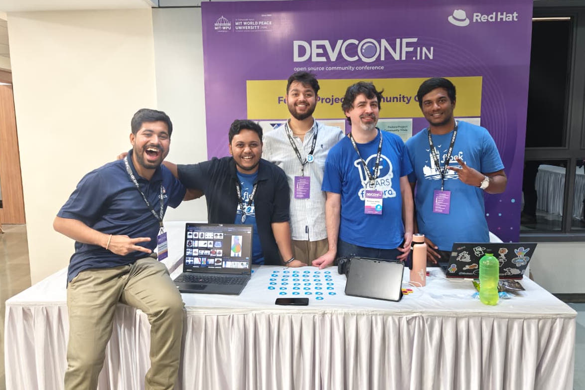
Fedora Project Staff (Akashdeep Dhar, CC BY-SA 4.0)
</td>
<td width="50%" align="center">
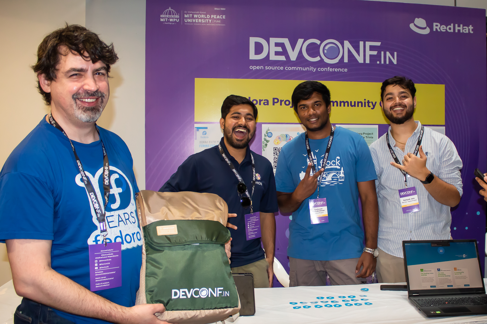
Matthew Miller at Booth (Shounak Dey, CC BY-SA 4.0)
</td>
</tr>
</table>

I was barely able to introduce myself to [Matthew](https://mattdm.org/) when [Akash](https://fedoraproject.org/wiki/User:T0xic0der) asked me to come with him to complete the registration first. At the registration desk, we received our IDs along with a [DevConf.IN](https://www.devconf.info/in/) badge and surprisingly, they handed over a [DevConf.IN](https://www.devconf.info/in/) branded backpack which we were not expecting.



After finishing with registration we were officially ready to welcome attendees.

## Talking to the Budding Linux Crowd

This is where things got real. As someone who primarily contributes to different Fedora applications mostly on backend systems and infrastructure code, I wasn't used to being the person **explaining Fedora to curious attendees**. But there I was, answering questions about:

- What is Fedora and how is it different from other distros?
- What are Fedora's core principles (Freedom, Friends, Features, First)?
- Why should someone choose Fedora over Ubuntu, Arch, or Debian?
- How can I contribute to Fedora?

The questions came fast and furious from enthusiastic students, developers and open-source newcomers. Some were **budding Linux users** who had just started their journey, while others were seasoned contributors looking to get involved with Fedora specifically.

<table>
<tr>
<td width="50%" align="center">
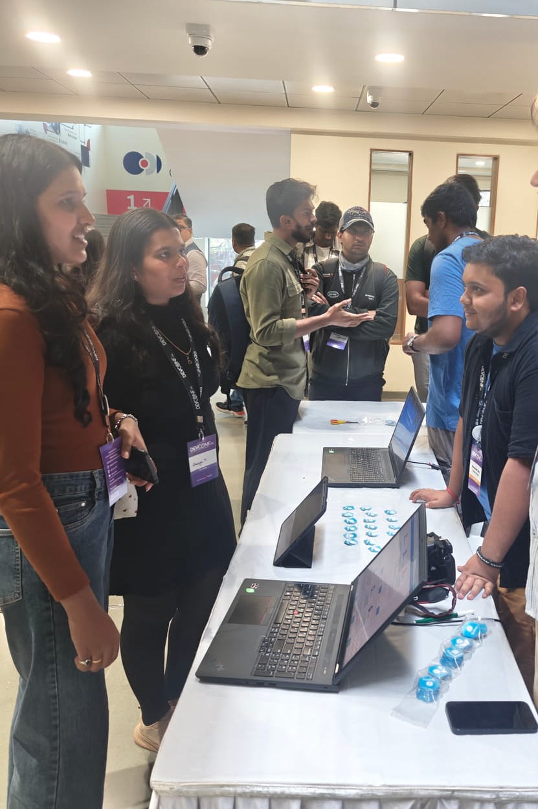
Booth Representation (Akashdeep Dhar, CC BY-SA 4.0)
</td>
<td width="50%" align="center">
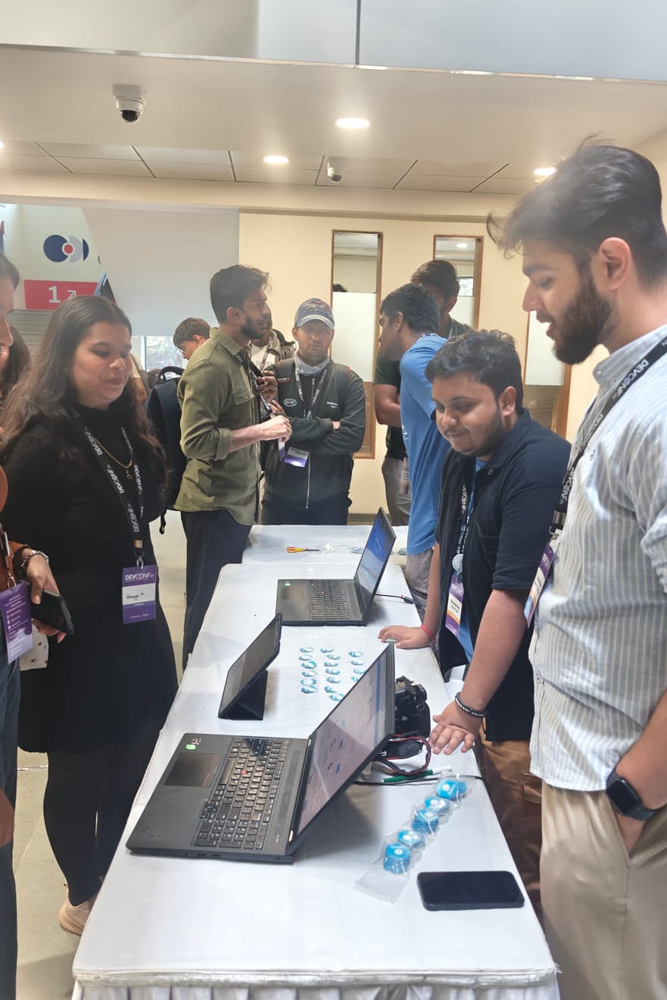
Booth Representation (Akashdeep Dhar, CC BY-SA 4.0)
</td>
</tr>
<tr>
<td colspan="2" align="center">
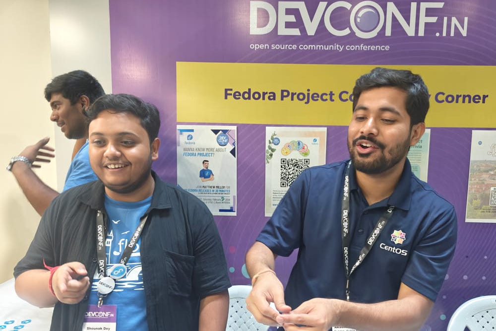
Booth Representation (Akashdeep Dhar, CC BY-SA 4.0)
</td>
</tr>
</table>

One attendee was particularly interested in contributing towards any frontend change that we might be working on currently. I introduced them to the [Fedora Badges Revamp Project](https://discussion.fedoraproject.org/t/a-history-lesson-2025-2026-update-on-fedora-badges-revamp-project/175412). We had a great conversation about what the [Fedora Badges](https://badges.fedoraproject.org/) Project is and what the [Fedora Badges Revamp Project](https://discussion.fedoraproject.org/t/a-history-lesson-2025-2026-update-on-fedora-badges-revamp-project/175412) is about. They left as a **probable contributor**, which felt amazing!

## Swag, Trivia and Digital Badges

Throughout the day, we:

- Informed attendees about **digital badges** they could claim by signing up
- Ran a **trivia** with questions about [Fedora Project](https://fedoraproject.org/) basics
- Distributed swag including:
  - Physical badge cum fridge magnets
  - Stickers
  - Digital badges in their [FAS (Fedora Account System)](https://accounts.fedoraproject.org/) accounts

The **special swag** (a Fedora-branded sipper) was reserved for those who scored perfect score in the trivia **and** had good luck with the spin wheel!



## Lunch Break (If You Can Call It That)

While all this was happening, [Akash](https://fedoraproject.org/wiki/User:T0xic0der) and I left [Samyak](https://fedoraproject.org/wiki/User:Jnsamyak) and [Yashwanth](https://fedoraproject.org/wiki/User:Thisisyaash) to handle the booth. During this time, the footfall was reduced as most of the attendees had left for lunch.

After climbing **8 floors** through sixteen flights of stairs along with [Akash](https://fedoraproject.org/wiki/User:T0xic0der), we reached the dining establishment arranged by [DevConf.IN](https://www.devconf.info/in/), which volunteer Rahul Sharma had informed us about around **01:00 PM**. We did end up wasting our time though, since we found a huge queue at that place.

While coming back disappointed and hungry we met Pravin Satpute, who suggested that we have lunch at the cafeteria on the fifth floor. Due to this small suggestion, [Akash](https://fedoraproject.org/wiki/User:T0xic0der) and I finally managed to squeeze in a **15 minutes** lunch break along with [Avadhoot Dhere](https://www.linkedin.com/in/avadhoot-dhere-a035801a2/). Yes, you read that right **15 minutes!!** Conference life is no joke!

The dining choice was limited to a *Vegetarian Biryani* and *Cold Coffee*, but at around **02:30 PM**, that felt like a divine serving.

After coming back, we switched places with [Samyak](https://fedoraproject.org/wiki/User:Jnsamyak) and [Yashwanth](https://fedoraproject.org/wiki/User:Thisisyaash) so they could have lunch as well.

<table>
<tr>
<td width="50%" align="center">
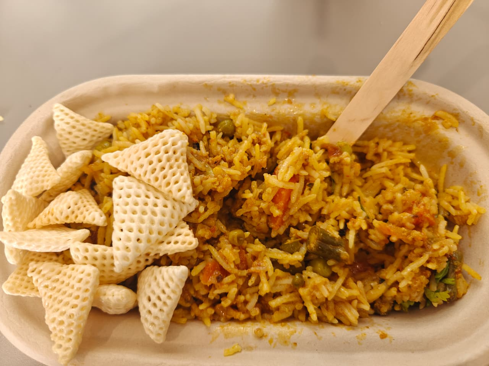
Veg Biryani (Shounak Dey, CC BY-SA 4.0)
</td>
<td width="50%" align="center">
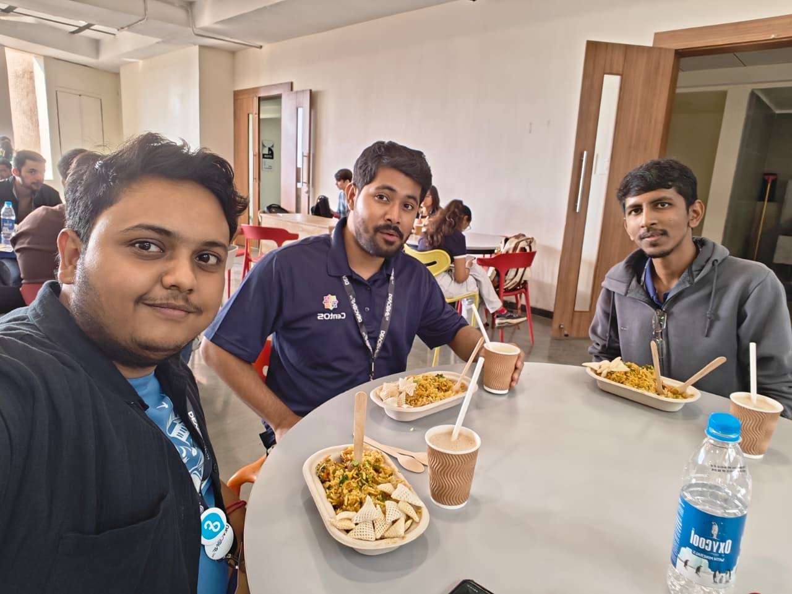
Lunch Break (Shounak Dey, CC BY-SA 4.0)
</td>
</tr>
</table>

## Booth Hopping

Before having lunch and being dissapponted and hungry while coming down from **8th Floor**, [Akash](https://fedoraproject.org/wiki/User:T0xic0der) and I visited other booths to see what they were up to:

- **[OKD](https://www.okd.io/)**: community driven, open source upstream distribution of [Red Hat OpenShift](https://www.redhat.com/en/technologies/cloud-computing/openshift)
- **[Backstage](https://backstage.io/)**: An open platform for building developer portals
- **[FOSS United](https://fossunited.org/)**: A non-profit foundation promoting and strengthening the FOSS ecosystem in India

It's always inspiring to see what other open-source projects are building!



## Unexpected Visitor

We had an unexpected visitor at our booth [Sayak](https://fedoraproject.org/wiki/User:Sayaksarkar). Even [Akash](https://fedoraproject.org/wiki/User:T0xic0der) wasn't expecting him to be there.

I briefly introduced myself and [Akash](https://fedoraproject.org/wiki/User:T0xic0der) mentioned that [Sayak](https://fedoraproject.org/wiki/User:Sayaksarkar) is a [Fedora Badges](https://badges.fedoraproject.org/) enthusiast who wanted to learn about the [Fedora Badges Revamp Project](https://discussion.fedoraproject.org/t/a-history-lesson-2025-2026-update-on-fedora-badges-revamp-project/175412). Due to time constraints, we decided to schedule the demo for Day 2. Then [Sayak](https://fedoraproject.org/wiki/User:Sayaksarkar) took a leave for checking out other booths and talks.



## The Grand Finale: Day 1 Trivia Winners

As the day wound down, at about 4 PM, [Samyak](https://fedoraproject.org/wiki/User:Jnsamyak) started jotting down names for the **day's special swag distribution** from the **Trivia** winners. Around 90 people registered on Day 1 and we got around 10 winners from that. As we only had a selected number of **special swag** (Fedora Branded Sipper), 4 in total for Day 1, we announced the 4 winners using the wheel.

It was exciting seeing attendees wait and watch if they had the luck to win the **special swag**.

[Akash](https://fedoraproject.org/wiki/User:T0xic0der) and [Samyak](https://fedoraproject.org/wiki/User:Jnsamyak) did the honors of giving out the **special swag** to the winners while I captured each giveaway moment on my camera.

<table>
<tr>
<td width="50%" align="center">
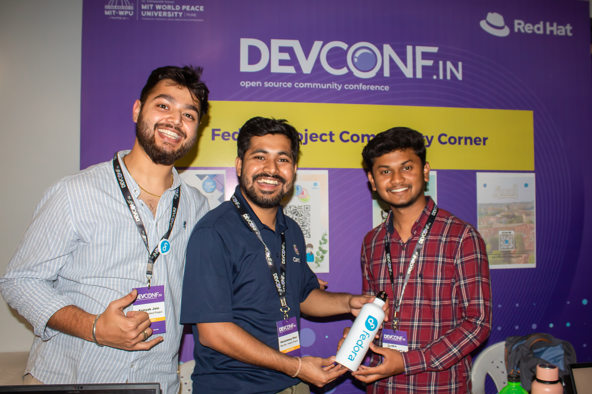
Trivia Winner 1 (Shounak Dey, CC BY-SA 4.0)
</td>
<td width="50%" align="center">
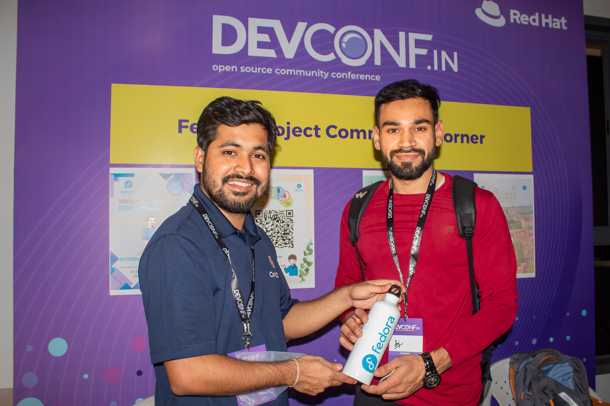
Trivia Winner 2 (Shounak Dey, CC BY-SA 4.0)
</td>
</tr>
<tr>
<td width="50%" align="center">
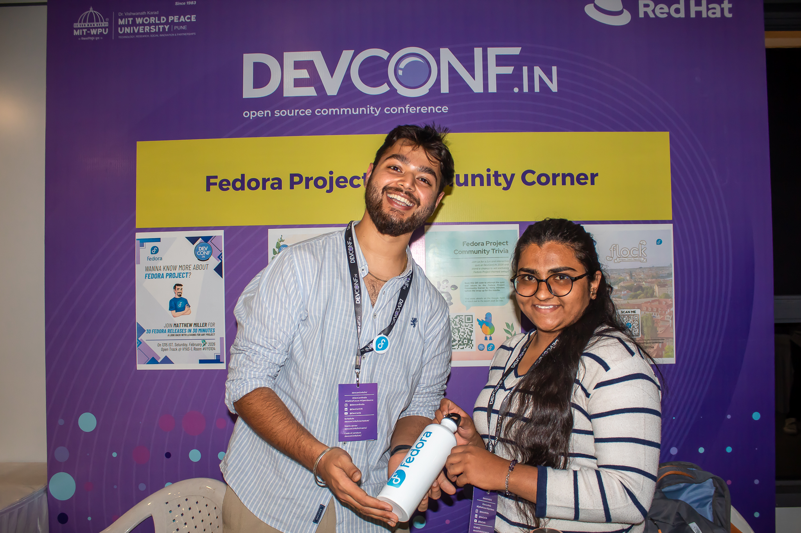
Trivia Winner 3 (Shounak Dey, CC BY-SA 4.0)
</td>
<td width="50%" align="center">
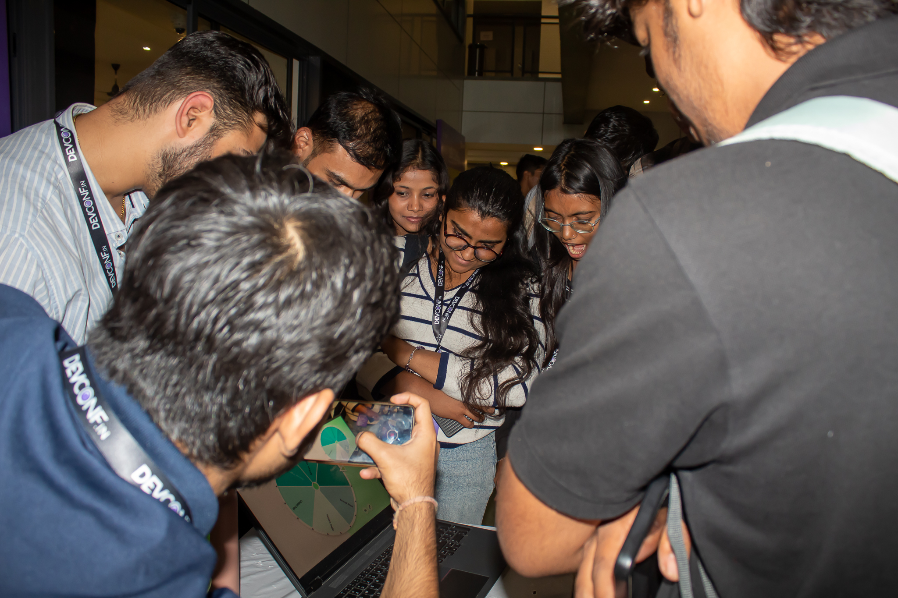
Wheel of Luck (Shounak Dey, CC BY-SA 4.0)
</td>
</tr>
</table>

## Wrapping Up Day 1

By the end of Day 1, I was exhausted but energized. The experience of talking to so many people, explaining open-source philosophy and representing [Fedora Project](https://fedoraproject.org/) was surreal.

All 4 of us walked together to the gate and started booking cabs/autos to get back to our homes/hotels to freshen up and take a bit of rest before we headed out for the community dinner.

## Community Dinner at Wasabi 15



Community dinner was planned at [Wasabi 15](https://maps.app.goo.gl/bsG43AMg8ELh2JKk9), Viman Nagar, near Pune airport. After freshening up, getting some rest and reflecting on the surreal experience, it was time to get ready again for the much-awaited dinner after our **15 minute** lunch.

Finding a cab/auto proved to be quite challenging with the ongoing issues with cab/auto drivers in Pune these days. Due to the delays, we all agreed to postpone the meeting time from 8:00 PM to 8:30 PM. [Akash](https://fedoraproject.org/wiki/User:T0xic0der) made the changes to the reservation and confirmed with us.

I finally got a cab and arrived around 8:25 PM. [Samyak](https://fedoraproject.org/wiki/User:Jnsamyak) and [Yashwanth](https://fedoraproject.org/wiki/User:Thisisyaash) were already there. As I was heading up, [Akash](https://fedoraproject.org/wiki/User:T0xic0der) also arrived. We went up together and met [Samyak](https://fedoraproject.org/wiki/User:Jnsamyak) and [Yashwanth](https://fedoraproject.org/wiki/User:Thisisyaash).

Since we were already running a bit late and it had been a long day, we quickly started checking the menu and ordering food. For starters, [Samyak](https://fedoraproject.org/wiki/User:Jnsamyak) chose Asparagus Cream Cheese Sushi and Peri Peri French Fries to suit his dietary preferences, while the rest of us ordered Dakgangjeong, Korean Fried Chicken, Tuna Mayo Gimbap and Chicken Kimchi Gimbap.

While waiting for our food to arrive, [Yashwanth](https://fedoraproject.org/wiki/User:Thisisyaash) shared his early open source program experiences. All three of us could sense his frustration with the use of AI while contributing to open source programs like Outreachy and GSoC.

I shared my experience contributing to the [Fedora Project](https://fedoraproject.org/) and how the maintainers approach AI contributions. [Akash](https://fedoraproject.org/wiki/User:T0xic0der) explained that in the [Fedora Project](https://fedoraproject.org/), they don't just evaluate PR quality - they also observe contributor behavior. They notice everything, including whether contributors ask for help or help others.

Meanwhile, our food arrived and we started digging in. It was my first time trying [Wasabi 15](https://maps.app.goo.gl/bsG43AMg8ELh2JKk9) and to their credit, they did not disappoint. Afterwards, we talked more about the day's events and what we could have done better.

For the main course, we ordered Stir Fry Ramen in Gangjang Sauce with Batter Fried Tofu for [Samyak](https://fedoraproject.org/wiki/User:Jnsamyak), Stir Fry Ramen in Teriyaki Sauce with Batter Fried Prawns for [Akash](https://fedoraproject.org/wiki/User:T0xic0der), Chicken Kung Pao with Butter Garlic Rice for [Yashwanth](https://fedoraproject.org/wiki/User:Thisisyaash) and Stir Fry Ramen in Gangjang Sauce with Batter Fried Chicken for me. Once again, [Wasabi 15](https://maps.app.goo.gl/bsG43AMg8ELh2JKk9) delivered.

<table>
<tr>
<td width="50%" align="center">
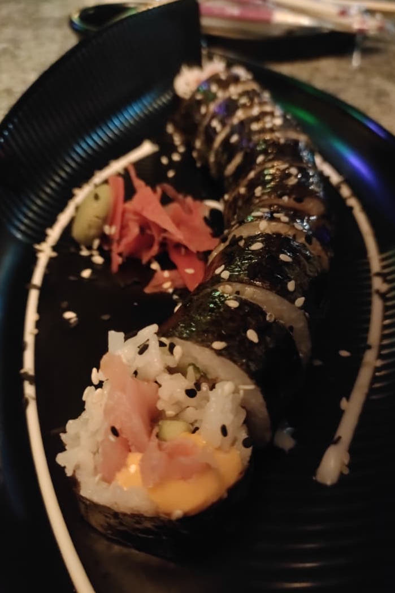
Tuna Mayo Gimbap (Shounak Dey, CC BY-SA 4.0)
</td>
<td width="50%" align="center">
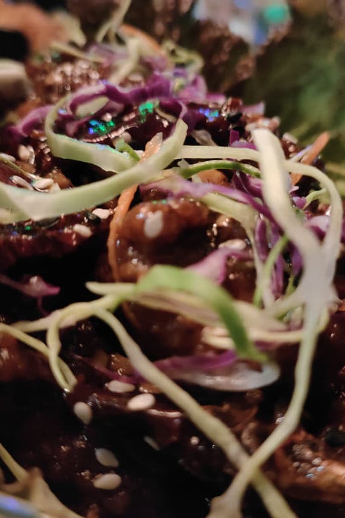
Dakgangjeong (Shounak Dey, CC BY-SA 4.0)
</td>
</tr>
<tr>
<td width="50%" align="center">
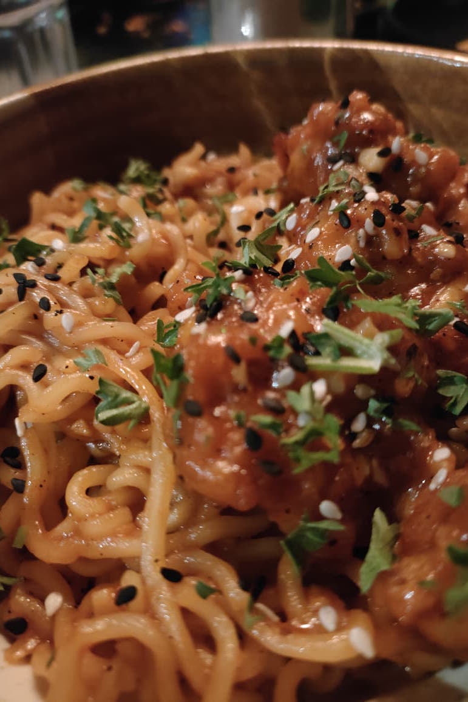
Stir Fry Ramen in Gangjang Sauce with Batter Fried Chicken (Shounak Dey, CC BY-SA 4.0)
</td>
<td width="50%" align="center">
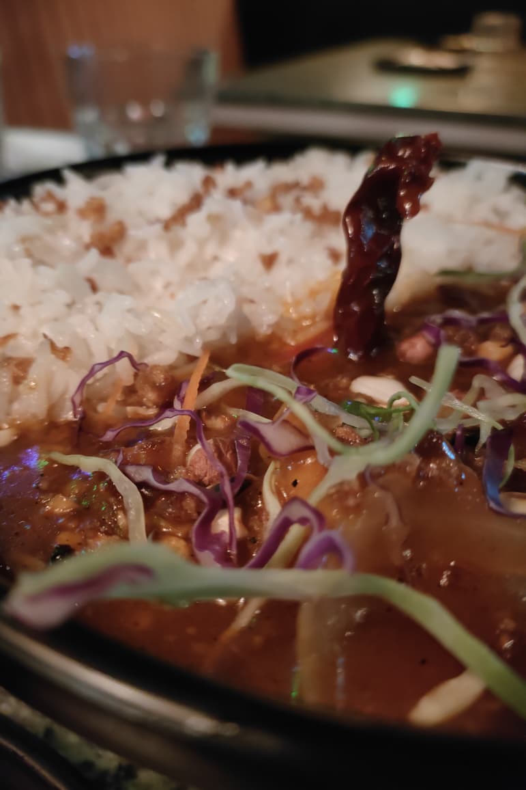
Chicken Kung Pao with Butter Garlic Rice (Shounak Dey, CC BY-SA 4.0)
</td>
</tr>
</table>

After wrapping up our dinner we took some group pictures and said goodbye for the day. [Akash](https://fedoraproject.org/wiki/User:T0xic0der) and me waited for [Samyak](https://fedoraproject.org/wiki/User:Jnsamyak) and [Yashwanth](https://fedoraproject.org/wiki/User:Thisisyaash) to board their cabs first and then we boarded ours.

---

##### [Day 2: Deep Conversations & Matthew's Talk →](../day-2/)
