##### [← Back to Day 1: Setting Up & Finding My Voice](../day-1/)

## Day 2 Highlights (TLDR):
- Booth setup complete by 11:00 AM (on Valentine's Day!)
- Deep conversation with [Swamprakash](https://www.linkedin.com/in/swayamprakashpatro/) about open source contribution
- Helped attendees create FAS accounts and claim digital badges
- Unexpected visitors: [Sudhir](https://www.linkedin.com/in/sudhir-dharanendraiah-80a0867/) and [Sayak](https://fedoraproject.org/wiki/User:Sayaksarkar) (demo cancelled due to network issues)
- Booth hopping Round 2: [FOSS United](https://fossunited.org/) (FOSS HACK event), [OKD](https://www.okd.io/) trivia (secured 2nd place!), [FreeIPA](https://www.freeipa.org/) passkey demo, [Tekton](https://tekton.dev/) & [Argo CD](https://argo-cd.readthedocs.io/en/stable/), [Backstage](https://backstage.io/)
- Attended [Matthew Miller's](https://mattdm.org/) inspiring talk: ["35 Fedora Releases in 35 Minutes"](https://www.youtube.com/watch?v=rEvszAURzJE)
- Final trivia reveal with [Matthew](https://mattdm.org/) handing over special swag to winners
- Late lunch at [La Sicilia Bistro and Patisserie](https://lasiciliarestaurant.in/) with memorable stories
- Community dinner at [Ishaara](https://www.bellonahospitality.com/ishaara) (reduced to 4 people due to miscommunication)

---

## Another Early Start

Day 2 began with excitement, a little less nervousness and a bit more tiredness from Day 1.

While waiting for [Akash](https://fedoraproject.org/wiki/User:T0xic0der), I remembered it was February 14th (Valentine's Day), which explained the delays and cancellations [Akash](https://fedoraproject.org/wiki/User:T0xic0der) was facing. After some time I met up with [Akash](https://fedoraproject.org/wiki/User:T0xic0der) along with the swag packs and started our ride to the venue Vyas Building [MIT World Peace University (MIT WPU)](https://maps.app.goo.gl/F1Ju9MJaSqCNMpsV8) around **10:20 AM**.

On reaching the [Fedora Project](https://fedoraproject.org/) booth, we saw [Matthew](https://mattdm.org/) was already there (he had arrived around 10:00 AM), preparing for his talk **"35 Fedora Releases in 35 Minutes"**.



 [Yashwanth](https://fedoraproject.org/wiki/User:Thisisyaash) was already engaging with some attendees. Thankfully, no registration was needed today and most of the booth setup was already in progress. [Samyak](https://fedoraproject.org/wiki/User:Jnsamyak) joined us shortly after, and together we finished setting up the [Fedora Project](https://fedoraproject.org/) booth, completing everything efficiently as we now had experience from Day 1.



As the day progressed, the number of attendees steadily increased. We received similar questions as Day 1, but today attendees were more curious about getting started with contributing to the [Fedora Project](https://fedoraproject.org/).

## A Memorable Conversation with Swamprakash

As I was talking with attendes, I met [Swamprakash](https://www.linkedin.com/in/swayamprakashpatro/), a student from [MIT WPU](https://maps.app.goo.gl/F1Ju9MJaSqCNMpsV8) and we had what turned out to be one of the most meaningful conversations of the conference.

We talked about:

- **What is Fedora?** The basics, the philosophy, the community.
- **Why use Fedora?** The benefits and trade-offs compared to other distros.
- **How and why to contribute to open source** I shared my own journey and motivations.
- **Why don't contributors just fork the project and manage it on their own?** A great question that led to a discussion about community collaboration, shared maintenance burden, and the power of collective development.

Before parting ways, I shared my [LinkedIn](https://www.linkedin.com/in/sdglitched/) and [FAS](https://accounts.fedoraproject.org/user/sdglitched/) account details with him in case he wanted to connect and start his contribution journey. Moments like these remind me why community work matters.

## Helping Attendees Get Started

Throughout the morning I helped attendees with:

- Creating [FAS (Fedora Account System)](https://accounts.fedoraproject.org/) accounts
- Claim their digital badges
- Try out the trivia for a chance at special swag

<table>
<tr>
<td width="50%" align="center">
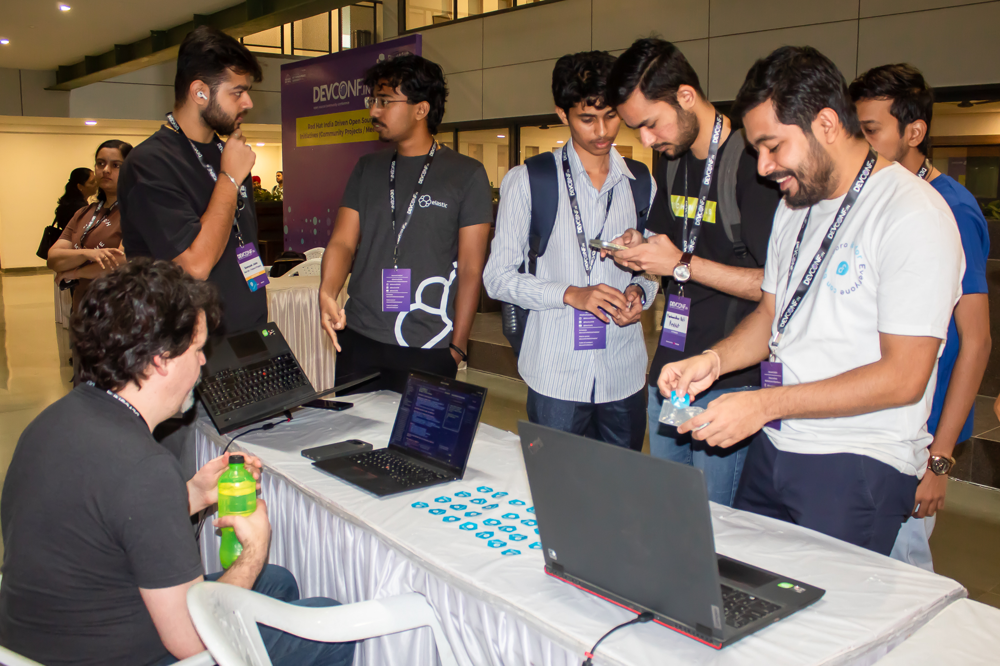
Attendee Interaction 1 (Shounak Dey, CC BY-SA 4.0)
</td>
<td width="50%" align="center">
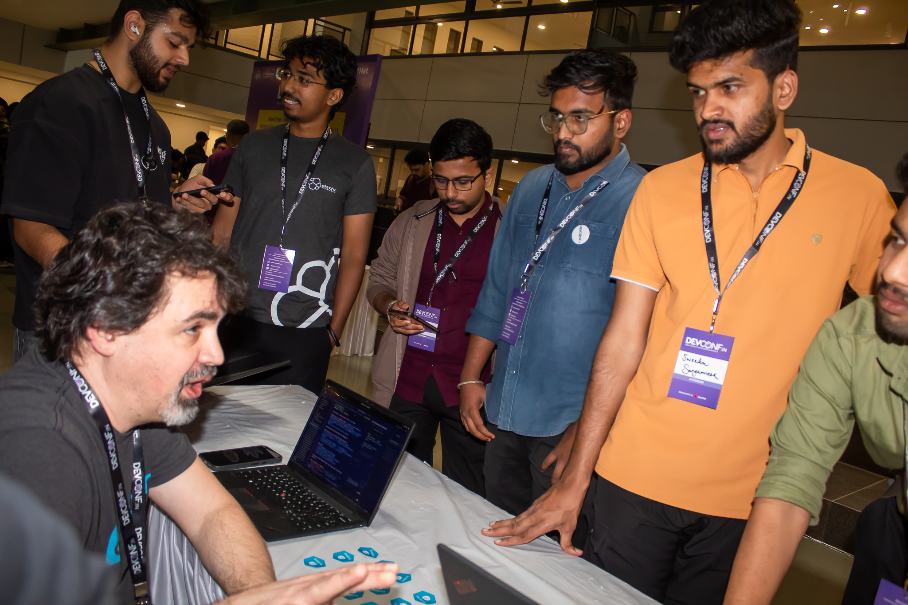
Attendee Interaction 2 (Shounak Dey, CC BY-SA 4.0)
</td>
</tr>
<tr>
<td width="50%" align="center">
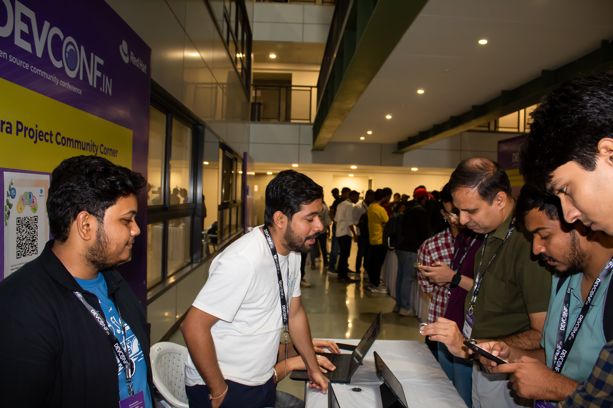
Attendee Interaction 3 (Shounak Dey, CC BY-SA 4.0)
</td>
<td width="50%" align="center">
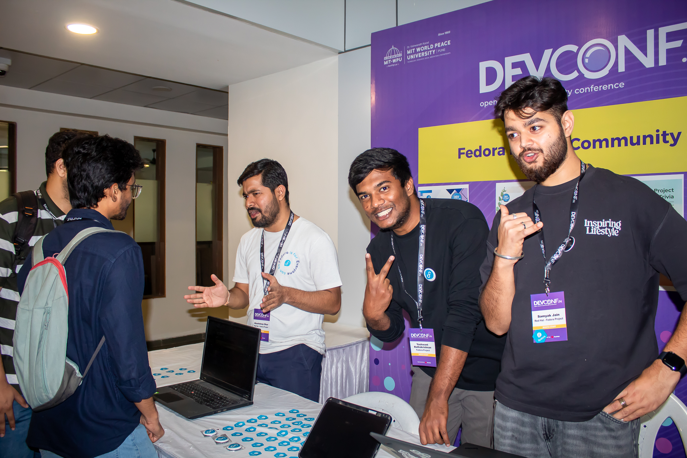
Attendee Interaction 4 (Shounak Dey, CC BY-SA 4.0)
</td>
</tr>
</table>

## Unexpected Visitors

We had another unexpected visitor at our booth - [Sudhir](https://www.linkedin.com/in/sudhir-dharanendraiah-80a0867/). I didn't know him personally, but [Akash](https://fedoraproject.org/wiki/User:T0xic0der) introduced us. We had a brief chat as the booth was filled with attendees at that time.

After some time, [Sayak](https://fedoraproject.org/wiki/User:Sayaksarkar) arrived at the booth, eager for the demo of the [Fedora Badges Revamp Project](https://discussion.fedoraproject.org/t/a-history-lesson-2025-2026-update-on-fedora-badges-revamp-project/175412). Although the booth was less crowded at that moment, we still couldn't provide the demo due to poor network connectivity, which caused significant delays in loading [Akash's](https://fedoraproject.org/wiki/User:T0xic0der) hosted [site](https://badges.gridhead.net/). Unfortunately, we had to cancel the demo once again.

## Booth Hopping Round 2

At around **12:00 PM**, I left the booth in the capable hands of [Akash](https://fedoraproject.org/wiki/User:T0xic0der) and [Samyak](https://fedoraproject.org/wiki/User:Jnsamyak) and went booth hopping with [Yashwanth](https://fedoraproject.org/wiki/User:Thisisyaash).

Here's what we explored:

- **[FOSS United](https://fossunited.org/)**: The folks running the booth explained that FOSS United is a non profit foundation promoting and strengthening the FOSS ecosystem in India. We learned about their flagship event [FOSS HACK](https://fossunited.org/fosshack/2026) scheduled for the coming month (March'26). [FOSS United](https://fossunited.org/) is doing great work promoting open-source culture in India!



- **[OKD](https://www.okd.io/) Booth (Again!)**: This time, I was more interested in learning how to contribute to [OKD](https://www.okd.io/), whereas [Yashwanth](https://fedoraproject.org/wiki/User:Thisisyaash) got a full introduction to what [OKD](https://www.okd.io/) is. We participated in the **OKD trivia** along with another attendee, and I secured **2nd place** and scored some awesome **OKD stickers**!



- **[FreeIPA](https://www.freeipa.org/)**: I already knew a bit about FreeIPA as I've seen it used in some of the [Fedora Apps](https://apps.fedoraproject.org/) that I've contributed to, but I didn't know that FreeIPA is the upstream open-source project for Red Hat Identity Management. The folks running the booth were stormed with attendees just like our booth, and yet they managed to show a fantastic **live demonstration of passkey authentication** along with **Fedora integration**.

- **Secure Flow ([Tekton](https://tekton.dev/) & [Argo CD](https://argo-cd.readthedocs.io/en/stable/))**: This booth was particularly technical, and the booth staff were not very eager to explain what these tools are about. From the brief explanation I received, I understood that Argo CD and Tekton are tools that automate software building and deployment on Kubernetes. Tekton handles building and testing, while Argo CD handles automated deployment. I tried their trivia that dove deep into the **working mechanisms behind the scenes**, which I cant't know (duhhh).

- **[Backstage](https://backstage.io/)**: Learned a bit more about what [Backstage](https://backstage.io/) offers at the **enterprise level** - building developer portals and improving developer experience at scale. I asked how [Backstage](https://backstage.io/) is different from [ServiceNow](https://www.servicenow.com/in/) apart from [Backstage](https://backstage.io/) being free and open source, but the answer was unsatisfying. I tried the crossword puzzle they prepared, but since [Matthew's](https://mattdm.org/) talk was coming up soon, I had to leave it unfinished.



## Matthew Miller's Talk: "35 Fedora Releases in 35 Minutes"

At around **12:50 PM**, I came back to help [Akash](https://fedoraproject.org/wiki/User:T0xic0der) and [Samyak](https://fedoraproject.org/wiki/User:Jnsamyak) pack up the booth which they had already managed to do. We headed straight to room VY0104 to attend one of the most anticipated talks of the conference, scheduled for **1:15 PM**, ["35 Fedora Releases in 35 Minutes"](https://mattdm.org/fedora/) by none other than [Matthew Miller](https://mattdm.org/), former [Fedora Project Leader](https://docs.fedoraproject.org/en-US/council/fpl/).

We set up a **swag corner** in the talk room for attendees, and while [Matthew](https://mattdm.org/) spoke, I went around taking pictures to capture the moment.



The talk was exactly what the title promised, a **whirlwind tour through Fedora's history**. [Matthew](https://mattdm.org/) had initially planned to cover 30 releases but expanded it to cover all 35 major [releases](https://fedoraproject.org/wiki/Changes) and the evolution of the project over the years. He shared stories of:

- Key milestones in Fedora's journey, from history to major changes that took place
- The ancient naming convention Fedora used to follow
- Challenges and downfalls the project faced
- How the community stayed strong and resilient through it all

His storytelling made Fedora's history come alive, and it was inspiring to see how the project has grown and adapted while staying true to its core values.

<table>
<tr>
<td colspan="2" align="center">
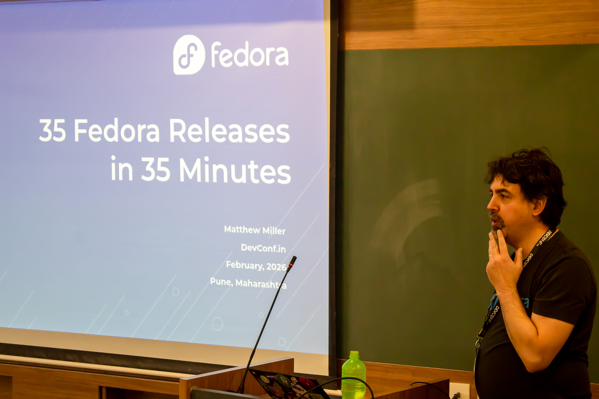
Matthew Miller's Talk (Shounak Dey, CC BY-SA 4.0)
</td>
</tr>
<tr>
<td width="50%" align="center">
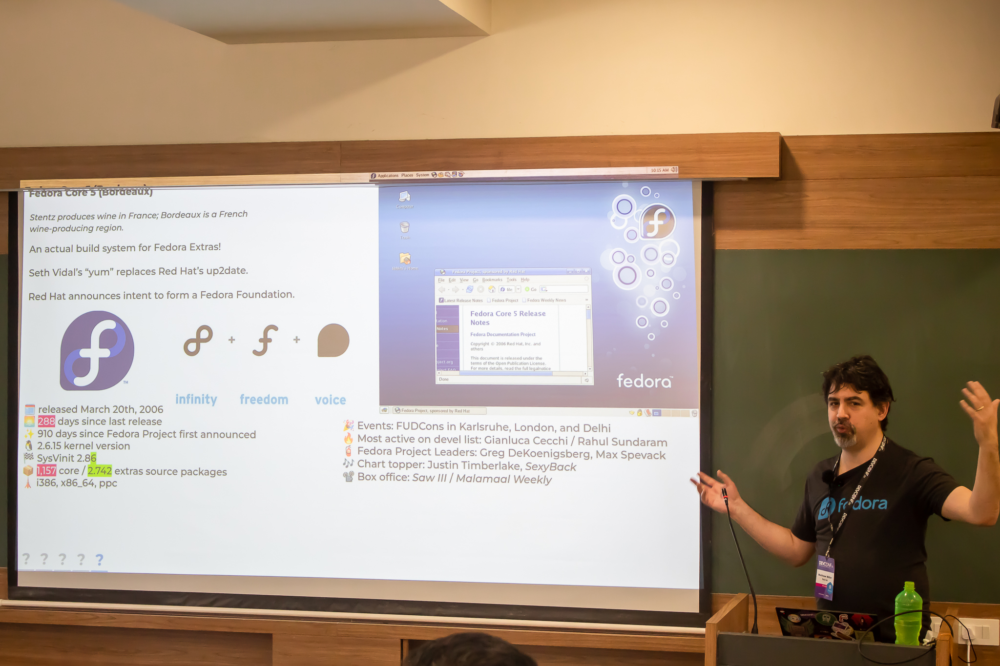
Fedora Core 5 Release (Shounak Dey, CC BY-SA 4.0)
</td>
<td width="50%" align="center">
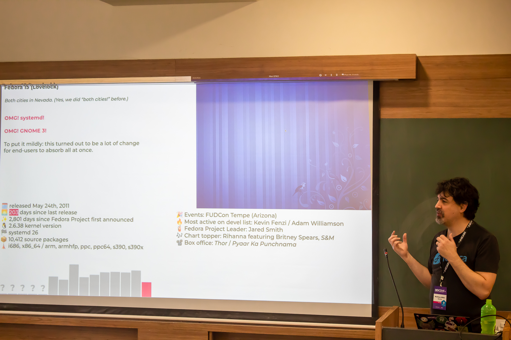
Fedora 15 Release (Shounak Dey, CC BY-SA 4.0)
</td>
</tr>
<tr>
<td width="50%" align="center">
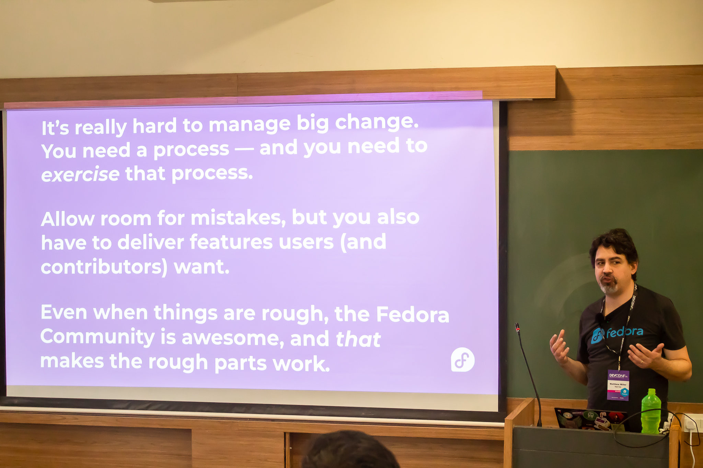
FPL Experience 1 (Shounak Dey, CC BY-SA 4.0)
</td>
<td width="50%" align="center">
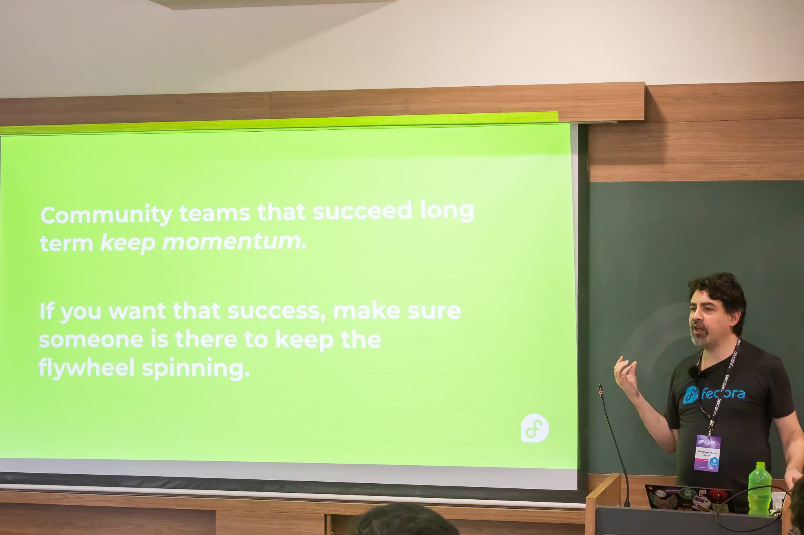
FPL Experience 2 (Shounak Dey, CC BY-SA 4.0)
</td>
</tr>
<tr>
<td width="50%" align="center">
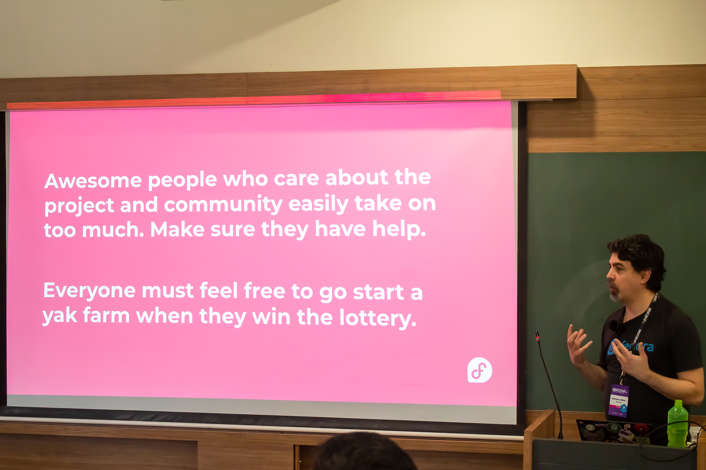
FPL Experience 3 (Shounak Dey, CC BY-SA 4.0)
</td>
<td width="50%" align="center">
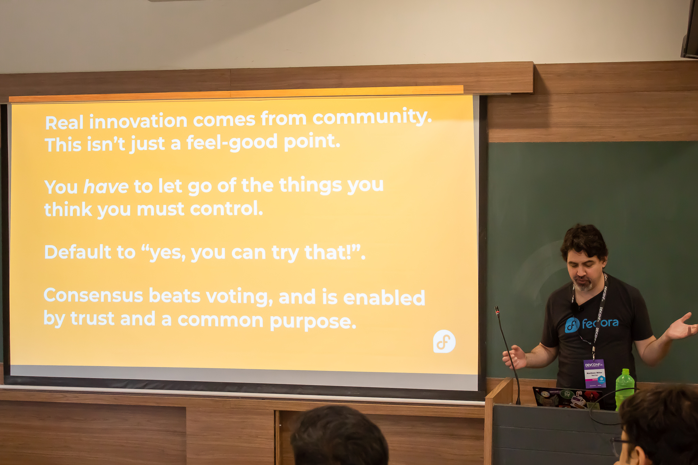
FPL Experience 4 (Shounak Dey, CC BY-SA 4.0)
</td>
</tr>
</table>

The 45-minute talk flew by, concluding around **2:00 PM**, and we headed back to the booth.

If you missed the talk, you can always watch it on [DevConf's YouTube channel](https://www.youtube.com/@DevConfs): ["35 Fedora releases in 35 minutes: a look back with lessons for any project - DevConf.IN 2026"](https://www.youtube.com/watch?v=rEvszAURzJE)

## The Grand Finale: Day 2 Trivia Winners

Back at the booth around **2:30 PM**, it was time for the **final reveal of the Day 2 trivia winners**. The crowd was extensive, and the excitement was at its peak as attendees now knew what the surprise was!

While [Samyak](https://fedoraproject.org/wiki/User:Jnsamyak) was creating the spin wheel, we started distributing the remaining swag to attendees to manage the crowd.

After the wheel was ready, we invited **[Matthew](https://mattdm.org/) to do the honors** of handing over the special swag to the winners.

<table>
<tr>
<td width="50%" align="center">
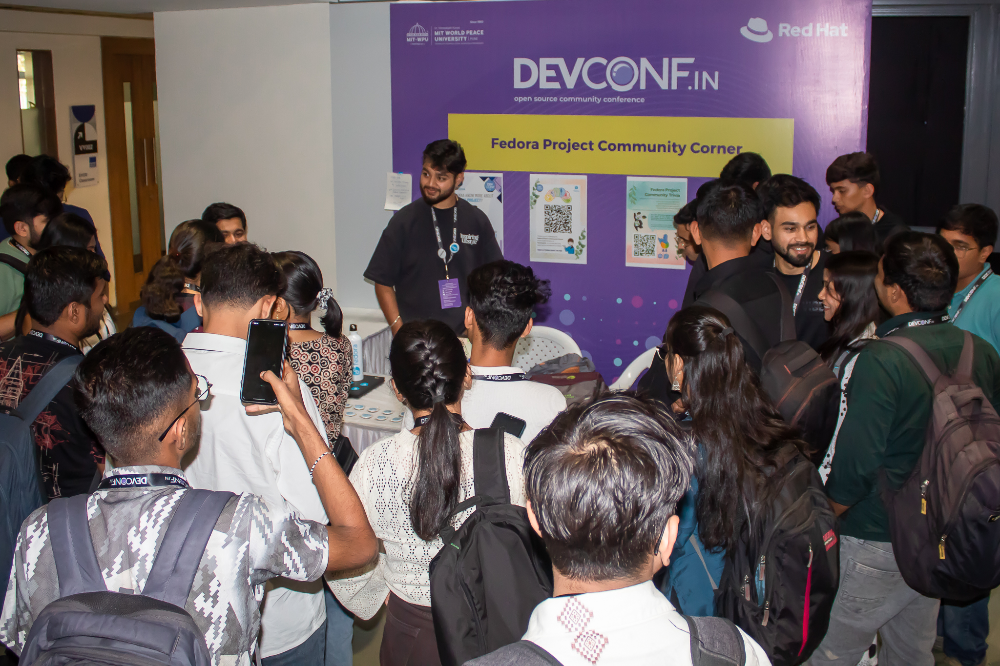
Crowd at Giveaway 1 (Shounak Dey, CC BY-SA 4.0)
</td>
<td width="50%" align="center">
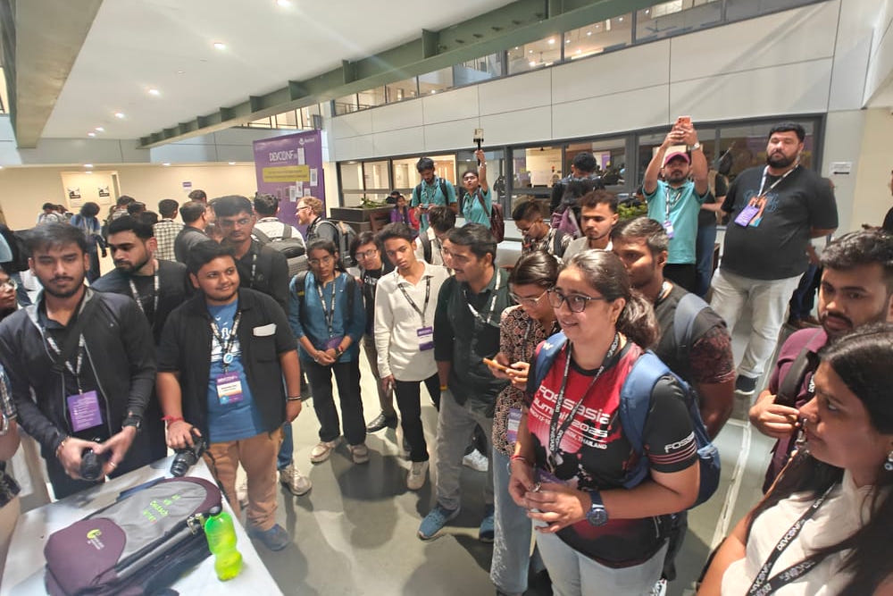
Crowd at Giveaway 2 (Akashdeep Dhar, CC BY-SA 4.0)
</td>
</tr>
<tr>
<td colspan="2" align="center">
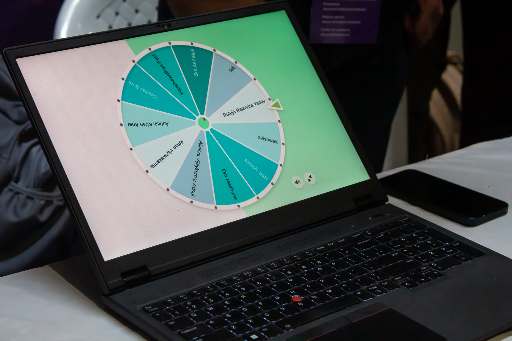
Wheel of Luck (Shounak Dey, CC BY-SA 4.0)
</td>
</tr>
<tr>
<td width="50%" align="center">
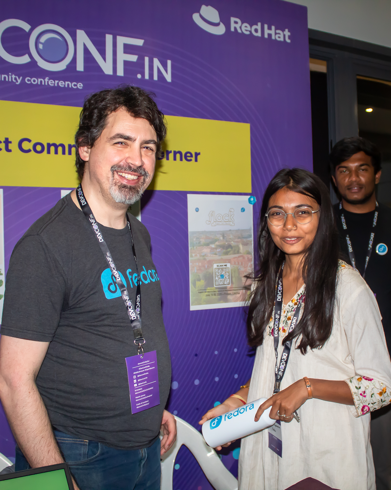
Trivia Winner 1 (Shounak Dey, CC BY-SA 4.0)
</td>
<td width="50%" align="center">
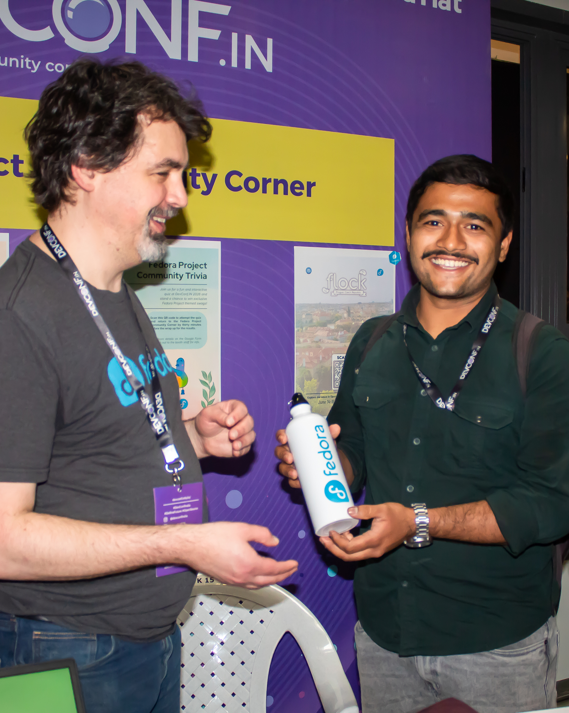
Trivia Winner 2 (Shounak Dey, CC BY-SA 4.0)
</td>
</tr>
<tr>
<td width="50%" align="center">
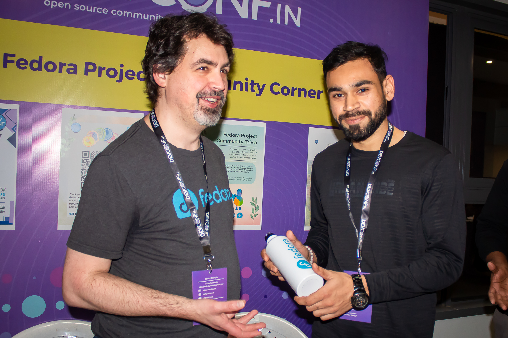
Trivia Winner 3 (Shounak Dey, CC BY-SA 4.0)
</td>
<td width="50%" align="center">
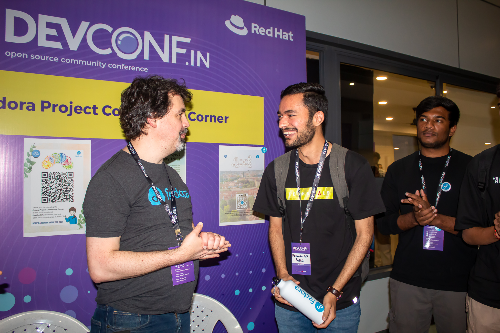
Trivia Winner 4 (Shounak Dey, CC BY-SA 4.0)
</td>
</tr>
</table>

## Wrapping Up Day 2

By **3:30 PM**, we packed up the booth for the final time. It was bittersweet - exhausting yet rewarding.

As I was reflecting on today's experience, [Samyak](https://fedoraproject.org/wiki/User:Jnsamyak) asked where we were all having lunch. That's when I remembered nobody had eaten lunch and it was already this late.

[Akash](https://fedoraproject.org/wiki/User:T0xic0der) asked me to check for places where we could get good food at this hour. I started looking for a restaurant that could cater to all of us and found [La Sicilia Bistro and Patisserie](https://lasiciliarestaurant.in/), which was close by and still serving food. I proposed it to everyone and after a quick menu check, everyone agreed.

Meanwhile, [Avadhoot](https://www.linkedin.com/in/avadhoot-dhere-a035801a2/) joined us and [Akash](https://fedoraproject.org/wiki/User:T0xic0der) extended the invitation to him as well. [Akash](https://fedoraproject.org/wiki/User:T0xic0der) started looking for a cab while we took some photos at the [DevConf.IN](https://www.devconf.info/in/) photo booth and banner.

Once the cab arrived, [Akash](https://fedoraproject.org/wiki/User:T0xic0der), [Samyak](https://fedoraproject.org/wiki/User:Jnsamyak), [Yashwanth](https://fedoraproject.org/wiki/User:Yashwanth), and I boarded it while [Avadhoot](https://www.linkedin.com/in/avadhoot-dhere-a035801a2/) used his scooter to get to the location.

<table>
<tr>
<td colspan="2" align="center">
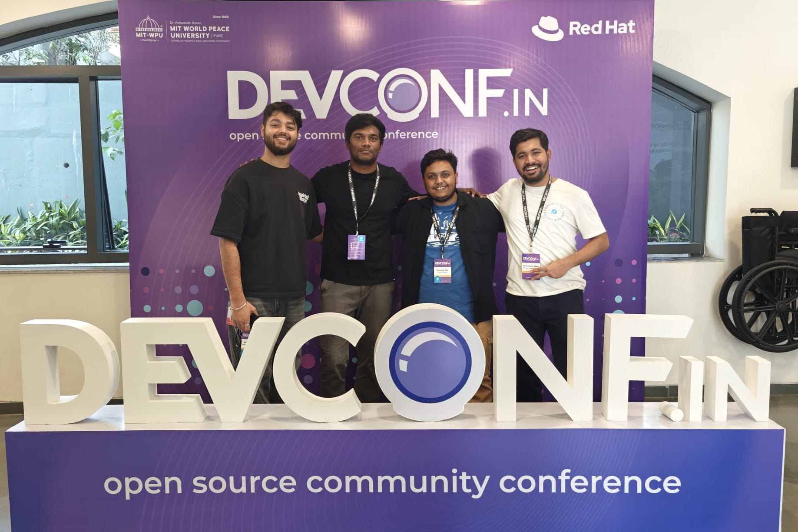
DevConf Photo Booth (Akashdeep Dhar, CC BY-SA 4.0)
</td>
</tr>
<tr>
<td width="50%" align="center">
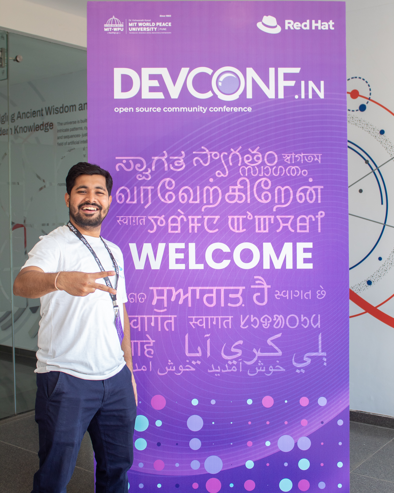
Akashdeep at DevConf (Shounak Dey, CC BY-SA 4.0)
</td>
<td width="50%" align="center">
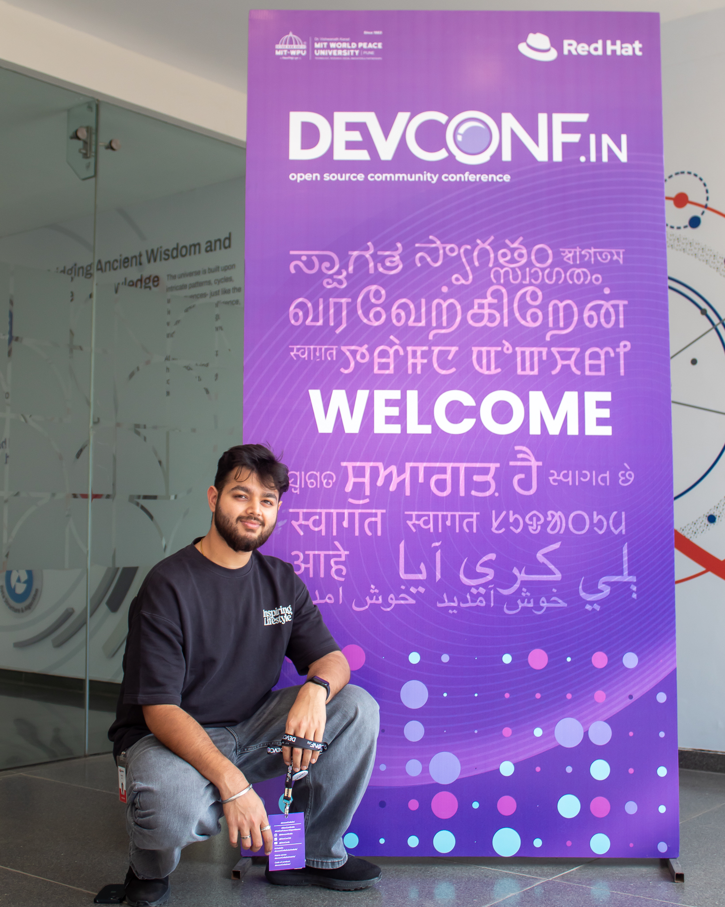
Samyak at DevConf (Shounak Dey, CC BY-SA 4.0)
</td>
</tr>
<tr>
<td width="50%" align="center">
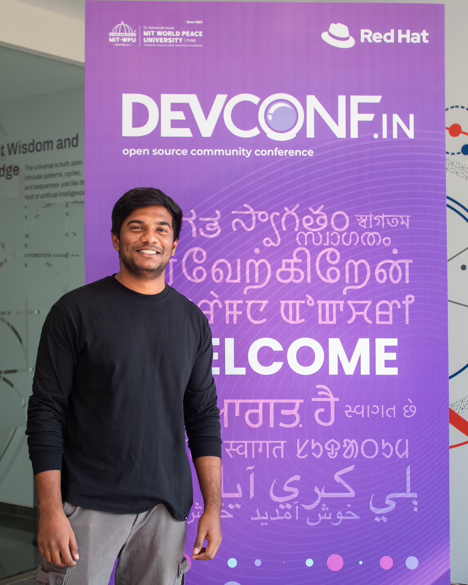
Yashwanth at DevConf (Shounak Dey, CC BY-SA 4.0)
</td>
<td width="50%" align="center">
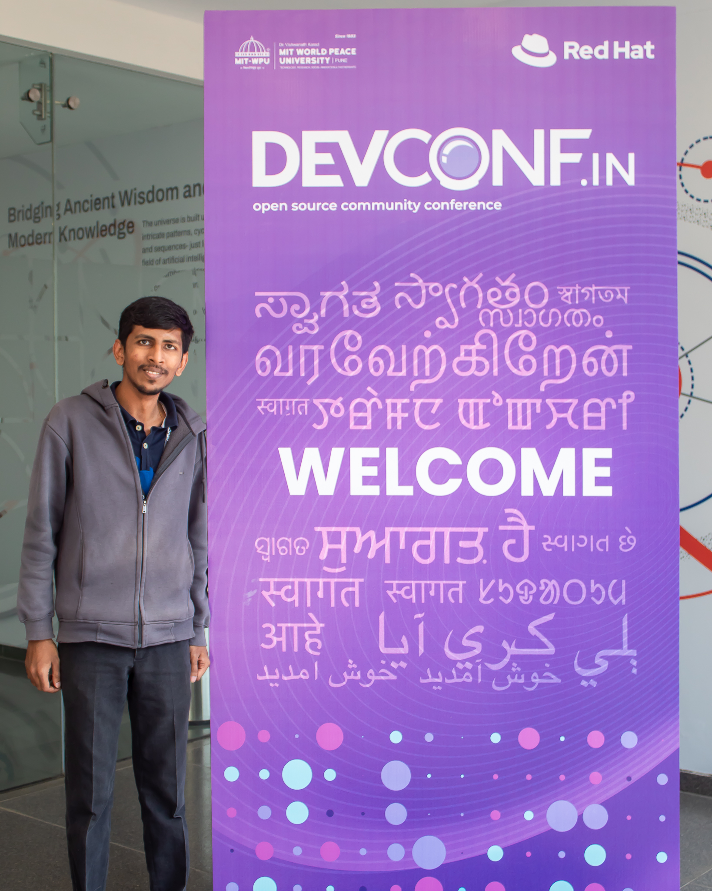
Avadhoot at DevConf (Shounak Dey, CC BY-SA 4.0)
</td>
</tr>
</table>

## Celebratory Lunch (Finally!)

After the non-stop action, we finally sat down for our **first proper meal of the day**, lunch at [La Sicilia Bistro and Patisserie](https://lasiciliarestaurant.in/) with [Akash](https://fedoraproject.org/wiki/User:T0xic0der), [Samyak](https://fedoraproject.org/wiki/User:Jnsamyak), [Yashwant](https://fedoraproject.org/wiki/User:Yashwanth) and [Avadhoot](https://www.linkedin.com/in/avadhoot-dhere-a035801a2/).

A restaurant staff member informed us that a portion of the menu would be closed in **10 minutes**, so we quickly started ordering food. [Samyak](https://fedoraproject.org/wiki/User:Jnsamyak) and [Avadhoot](https://www.linkedin.com/in/avadhoot-dhere-a035801a2/) started browsing the vegetarian options while [Akash](https://fedoraproject.org/wiki/User:T0xic0der), [Yashwant](https://fedoraproject.org/wiki/User:Yashwanth) and I started browsing the non-vegetarian options.

[Samyak](https://fedoraproject.org/wiki/User:Jnsamyak) and [Avadhoot](https://www.linkedin.com/in/avadhoot-dhere-a035801a2/) had lost their appetite due to the delay and only chose Veg Manchow Soup, Paneer Angara Kebab, and Cottage Cheese Bao, while [Akash](https://fedoraproject.org/wiki/User:T0xic0der), [Yashwant](https://fedoraproject.org/wiki/User:Yashwanth) and I were absolutely starving and chose Murgh Chilada Kebab, Tandoori Jhinga, Butter Garlic Prawns, Fish and Chips, Chicken Chipotle Pizza, and Paprika Chicken Pizza.

<table>
<tr>
<td width="50%" align="center">
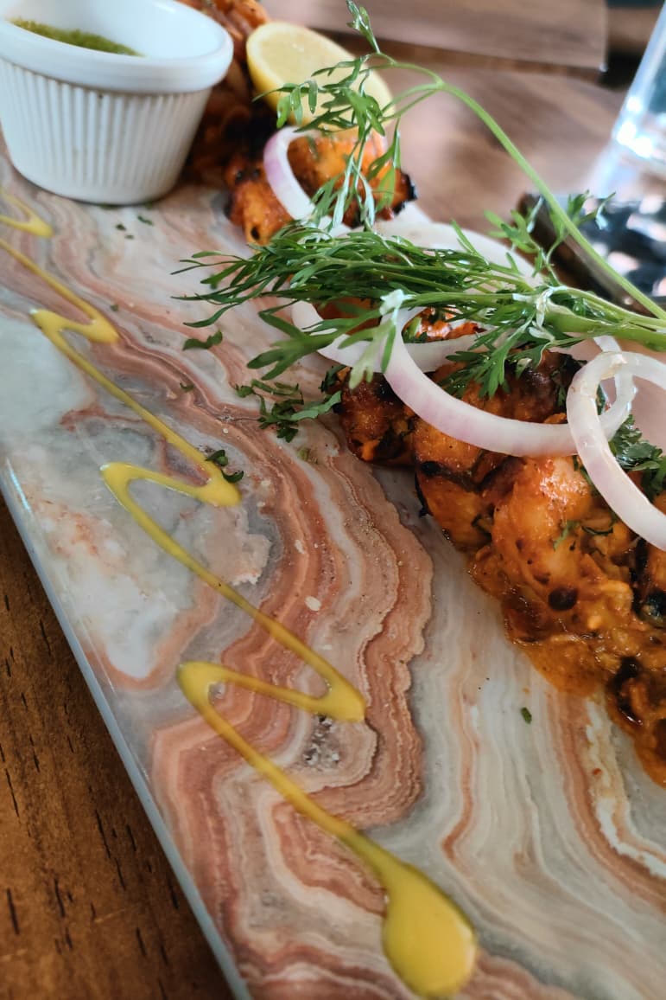
Tandoori Jhinga (Shounak Dey, CC BY-SA 4.0)
</td>
<td width="50%" align="center">
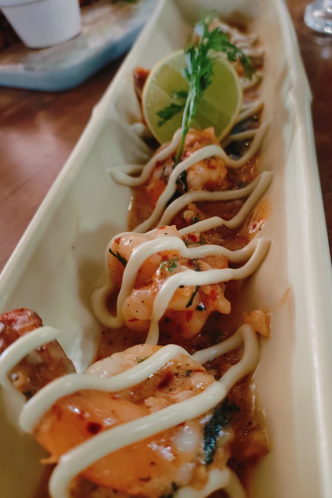
Butter Garlic Prawns (Shounak Dey, CC BY-SA 4.0)
</td>
</tr>
<tr>
<td width="50%" align="center">
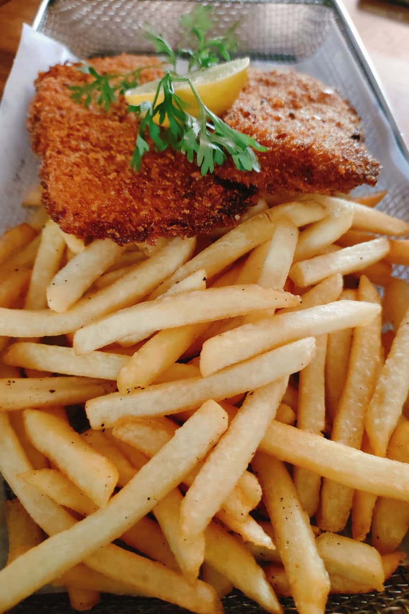
Fish and Chips (Shounak Dey, CC BY-SA 4.0)
</td>
<td width="50%" align="center">
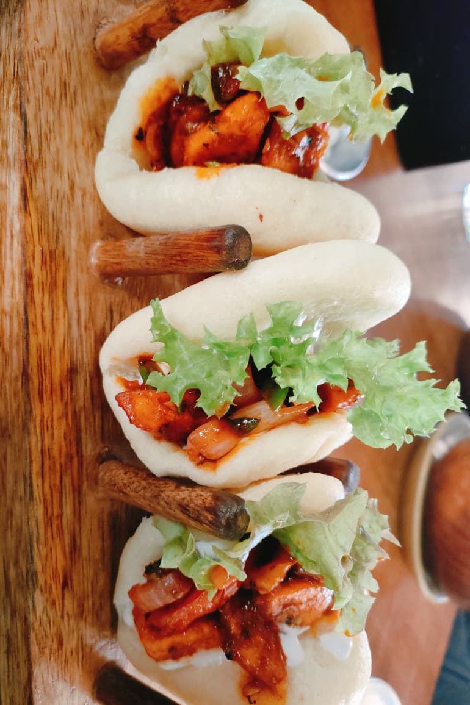
Cottage Cheese Bao (Shounak Dey, CC BY-SA 4.0)
</td>
</tr>
<tr>
<td width="50%" align="center">
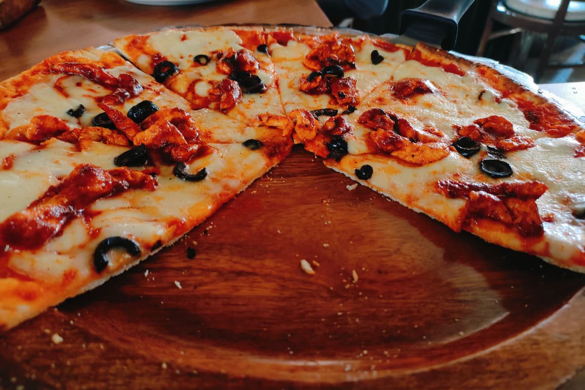
Chicken Chipotle Pizza (Shounak Dey, CC BY-SA 4.0)
</td>
<td width="50%" align="center">
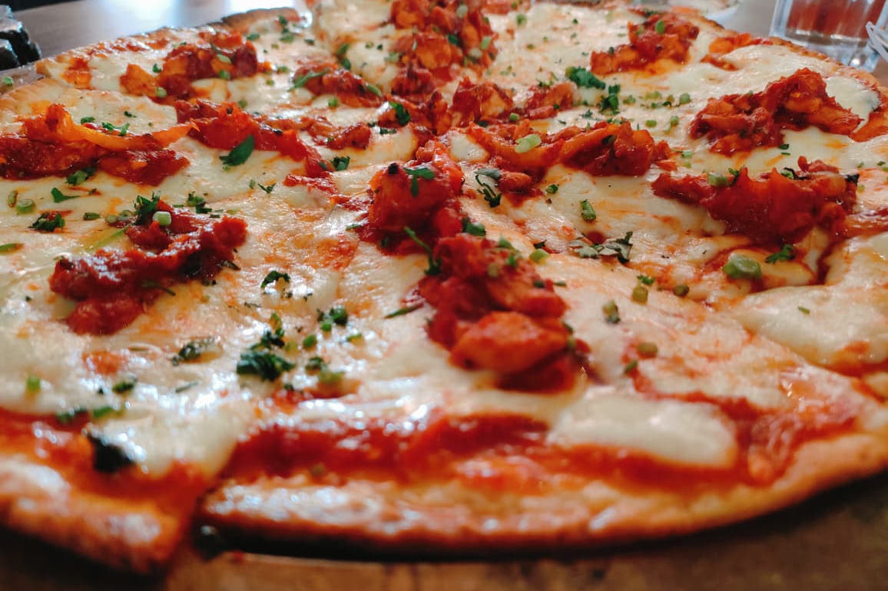
Paprika Chicken Pizza (Shounak Dey, CC BY-SA 4.0)
</td>
</tr>
</table>

While waiting for the food to arrive, [Akash](https://fedoraproject.org/wiki/User:T0xic0der) asked us to share our most memorable experiences from both Day 1 and Day 2. I started by sharing my overall experience, highlighting the deep conversation with [Swamprakash](https://www.linkedin.com/in/swayamprakashpatro/) and a weird incident where an attendee grabbed an entire stack of 50 stickers for themselves. [Yashwant](https://fedoraproject.org/wiki/User:Yashwanth) said his funniest moment was witnessing [Samyak](https://fedoraproject.org/wiki/User:Jnsamyak) writing a note saying "We are the [Fedora Project](https://fedoraproject.org/) booth and not the registration desk" for those attendees who thought the immense crowd meant it had to be the registration desk. [Akash](https://fedoraproject.org/wiki/User:T0xic0der) mentioned that for him, the most memorable encounter was discovering that Red Hat employees were interested in contributing to upstream projects, including the [Fedora Project](https://fedoraproject.org/).

Meanwhile, our lunch arrived and we started digging in as the hunger was overwhelming at that point.

After sharing laughs and reflecting on the incredible experience we had over the two days, we started booking our rides home. While waiting for the rides to arrive, we took a final photo to capture the moment. After that, we bid farewell to each other and left for our respective homes/hotels, tired but fulfilled.



## Community Dinner at Ishaara



Before [DevConf.IN 2026](https://www.devconf.info/in/) even started, [Samyak](https://fedoraproject.org/wiki/User:Jnsamyak) created hype for the grand Community Dinner at [Ishaara](https://www.bellonahospitality.com/ishaara), a unique restaurant that employs specially-abled people, offering both great food and a meaningful dining experience. The dinner was supposed to include [Matthew](https://mattdm.org/), Karen (Matthew's wife), [Sayak](https://fedoraproject.org/wiki/User:Sayaksarkar), [Sudhir](https://www.linkedin.com/in/sudhir-dharanendraiah-80a0867/) and the four of us - [Akash](https://fedoraproject.org/wiki/User:T0xic0der), [Samyak](https://fedoraproject.org/wiki/User:Jnsamyak), [Yashwant](https://fedoraproject.org/wiki/User:Yashwanth) and me.

This was much anticipated by all of us, but due to a booking mishap, the reservation was confirmed at the wrong Ishaara location, [Ishaara, Wakad](https://maps.app.goo.gl/dDbQNKZWDCkXFE4DA), about 30 kilometers away on the other end of Pune, instead of [Ishaara, Viman Nagar](https://maps.app.goo.gl/1L7sdBURBpteB9wq9). [Akash](https://fedoraproject.org/wiki/User:T0xic0der) had to create a new reservation at the correct location while [Matthew](https://mattdm.org/) and Karen unfortunately ended up at the Wakad branch. This dropped the count by two. Then [Samyak](https://fedoraproject.org/wiki/User:Jnsamyak) informed us that he had a high fever and wouldn't be able to join us. [Sayak](https://fedoraproject.org/wiki/User:Sayaksarkar) also had to take rain check reducing the count by two more.

In the end, after sorting out this mess, only four of us ([Sudhir](https://www.linkedin.com/in/sudhir-dharanendraiah-80a0867/), [Akash](https://fedoraproject.org/wiki/User:T0xic0der), [Yashwant](https://fedoraproject.org/wiki/User:Yashwanth) and me) were there for the much-awaited Community Dinner at [Ishaara, Viman Nagar](https://www.bellonahospitality.com/ishaara). Disappointing, but we made the most of it!

[Akash](https://fedoraproject.org/wiki/User:T0xic0der) and I reached the restaurant around **8:00 PM**, and [Sudhir](https://www.linkedin.com/in/sudhir-dharanendraiah-80a0867/) joined us shortly after. The restaurant's inclusive approach of employing specially-abled staff made the experience even more meaningful. While we were waiting for our table, I started talking with [Sudhir](https://www.linkedin.com/in/sudhir-dharanendraiah-80a0867/). I told him about my involvement with the [Fedora Project](https://fedoraproject.org/) and the contributions I'm currently working on. I learned that he's a Senior Manager at Red Hat and leads a team that maintains PyTorch for enterprise AI workloads on Red Hat platforms and even contributes to the PyTorch upstream.

Meanwhile, a staff member at [Ishaara](https://www.bellonahospitality.com/ishaara) took us to our table. [Yashwant](https://fedoraproject.org/wiki/User:Yashwanth) was running a bit late due to high demand for cabs at that time in the evening.

After a while, [Yashwant](https://fedoraproject.org/wiki/User:Yashwanth) arrived. Shortly after, [Akash](https://fedoraproject.org/wiki/User:T0xic0der) ordered the first item for our dinner - a single Bhuna Gosht Pizza. [Sudhir](https://www.linkedin.com/in/sudhir-dharanendraiah-80a0867/) mentioned that he had already had dinner with his team and wouldn't be eating much as he was just there to keep his promise and get to know [Yashwant](https://fedoraproject.org/wiki/User:Yashwanth) and me.

[Sudhir](https://www.linkedin.com/in/sudhir-dharanendraiah-80a0867/) left after that, and the three of us remained. Since we all had lunch very late in the afternoon, we weren't that hungry and felt almost full. So we just ordered a plate of Lucknow's famous Galouti Kebab to cleanse our palate.



While enjoying the Galouti Kebab, [Yashwant](https://fedoraproject.org/wiki/User:Yashwanth) mentioned some of his future goals around the [Fedora Project](https://fedoraproject.org/) and asked [Akash](https://fedoraproject.org/wiki/User:T0xic0der) what the best place would be to submit a proposal if he had one.

[Akash](https://fedoraproject.org/wiki/User:T0xic0der) explained in detail and told him to first categorize the proposal based on the [Priority Matrix](https://en.wikipedia.org/wiki/Priority_Matrix) and then post it on the [Fedora Project Discussion forum](https://discussion.fedoraproject.org/).



After dinner, we wrapped up and said our goodbyes. [Akash](https://fedoraproject.org/wiki/User:T0xic0der) and I waited for [Yashwant](https://fedoraproject.org/wiki/User:Yashwanth) to get his cab, and then we started looking for ours. Soon all the cabs arrived and we bid farewell with heavy hearts and a determination to meet again at a similar event.

---

##### [← Back to DevConf.IN 2026 Overview](../)
